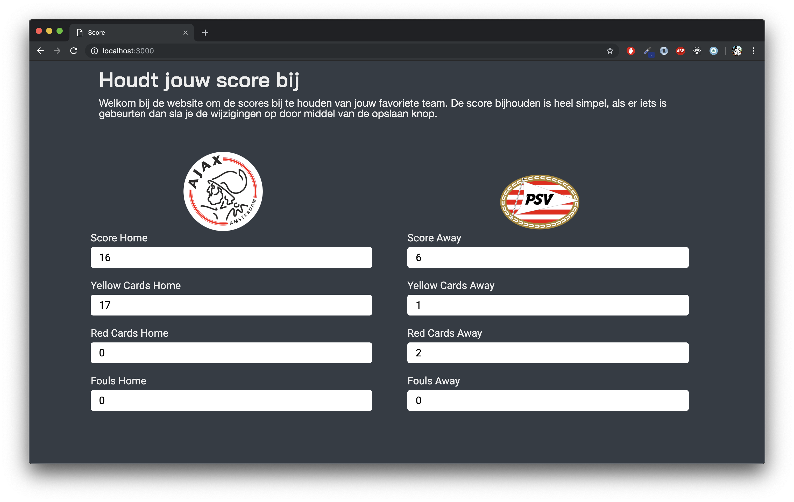
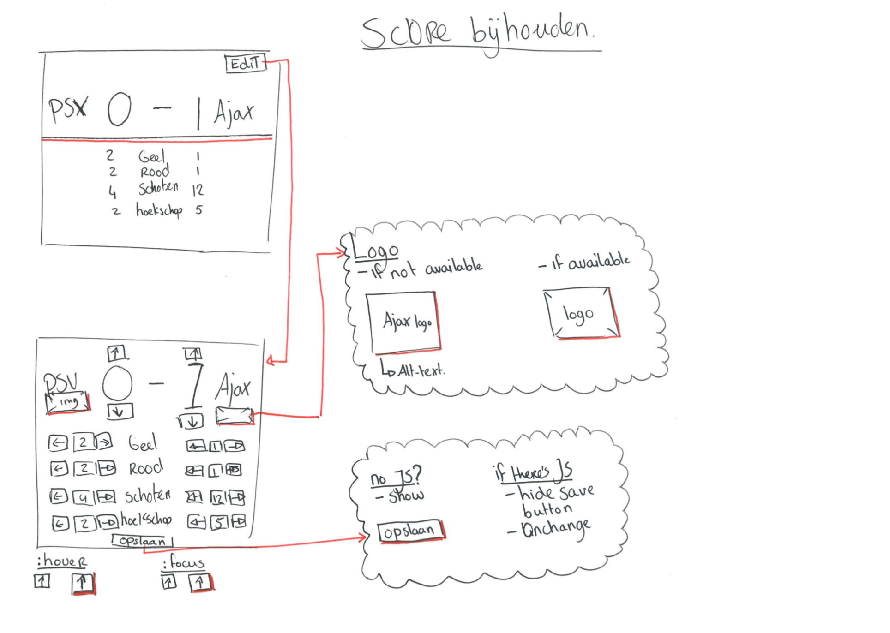

# Browser Technologies

## Summary
Score is een applicatie waar je de verschillende gebeurtenissen van een voetbalwedstrijd kunt bijhouden.

## Table of contents
- [Live demo](#Live-demo)
- [Install](#Install)
- [Concept](#Concept)
  - [Wireflow](#Wireflow)
- [Features](#Features)
- [Feature detection](#Feature-detection)
- [Progressive enhancement](#Progressive-enhancement)
- [To do](#To-do)
- [Resources](#Resources)
- [Criteria](#Criteria)

## Live demo
[Hier](https://guusdijkhuis.github.io/browser-technologies-1819/) is de link voor de live demo

## Installation
Als je mijn code wilt gebruiken kun je met de onderstaande mijn code clonen.
`git clone https://github.com/GuusDijkhuis/browser-technologies-1819.git`

## Concept

Als je een score wilt bijhouden dan kunt u dat doen door de score aan te passen met de pijltjes. De score wordt meestal automatisch opgeslagen maar er kan ook een opslaan knop staan.

  
